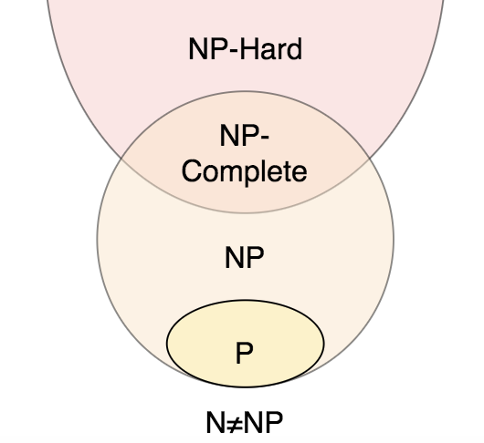

# NP 困難を理解する

## P(Polynomial)

- 問題の大きさ n の多項式時間で**解く**ことのできる判定問題の集合をクラス P という。 --> 効率的なアルゴリズムが見つかっている。

---

## NP(non-deterministic polynomial)

- 非決定的計算機であれば，問題を大きさ n の多項式時間で解くことができるアルゴリズムが存在する判定問題の集合。 --> 判定問題の解が与えられた時にその解が正しいかどうかを多項式時間で**検証**できる。
  > [!NOTE]
  > 非決定計算機: 処理の分岐のたびに都合の良い選択ができる幸運な計算機。また，並列計算の並列が無限に増やせる。理想的な並列計算機。

---

## NP 完全(non-deterministic polynomial perfect)

- 判定問題がクラス NP に属している。
- 判定問題ががクラス P に属することがわかった場合に任意の問題がクラス P になる。
- NP 完全であるならば，多項式時間で解くことができるアルゴリズムが存在しないことになるので，近似解を求める手法に移行できるの嬉しい。

---

## NP 困難(NP Hard)

- 判定問題が NP に属する任意の問題と比べて少なくとも同等以上に難しい。 --> 多項式時間で検証できるアルゴリズムが存在する可能性がある。

## 参考文献

- https://daigakudenki.com/np-hard/
- https://motojapan.hateblo.jp/entry/2017/11/15/082738
- https://vigne-cla.com/9-14/
